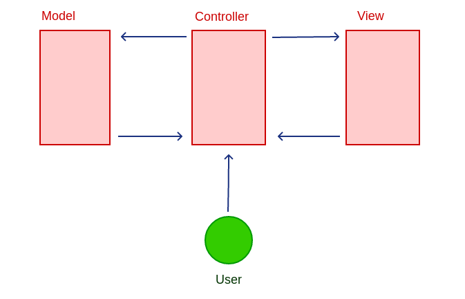

<h1>Budgety</h1>
<h3>MVC Budgety application.</h3>

The Complete JavaScript Course. https://www.udemy.com/the-complete-javascript-course/

<a href="https://romanyusupov2016.github.io/Budgety/index.html">Budgety</a> application on GitHub pages

This app works in the latest versions of Chrome. It doesn't work in Firefox for Linux.

MVC Budgety application plot: 
